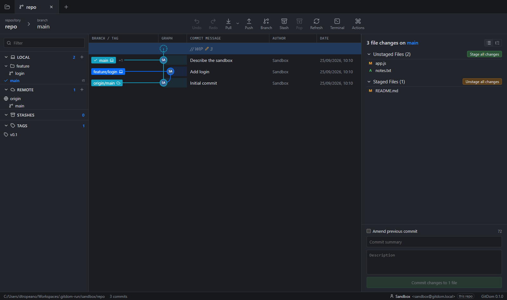
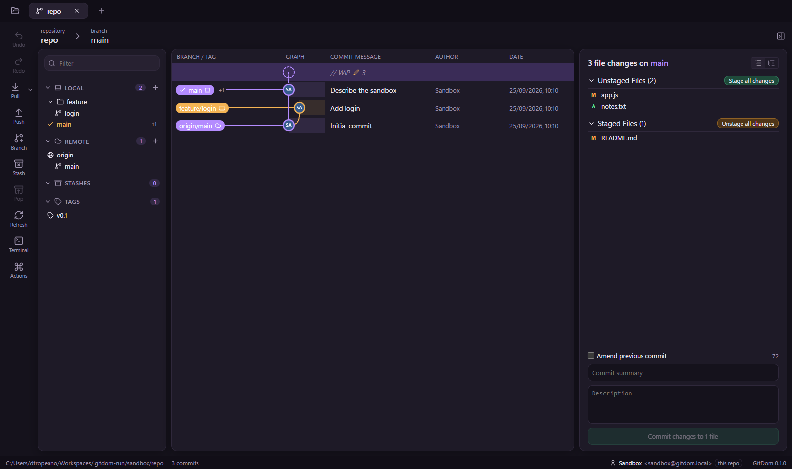
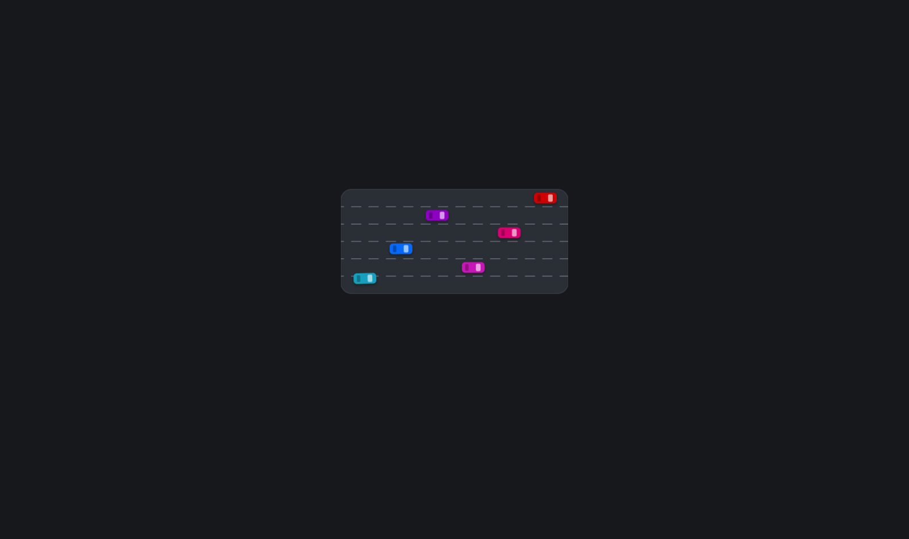

# GitDom

**A desktop Git client with an interactive commit graph.**
Many authors, one flow.

GitDom is a graphical client for everyday Git work: you can browse history, stage lines, merge, rebase and resolve conflicts from one window. It runs your installed `git` command line, so your hooks, config, credential manager, SSH keys and LFS work the same way they do in the terminal.



## Features

**Commit graph**

- Virtualized canvas graph that stays smooth on large histories, with colored lanes and branch/tag labels
- Local and remote branches that point to the same commit share one label
- Commit details, changed files, and diffs with syntax highlighting

**Everyday workflow**

- Stage and unstage whole files, single hunks or single lines
- Commit, amend, and a WIP row for your uncommitted changes
- Branches, checkout, tags and stashes from the sidebar
- Pull (merge, fast-forward only or rebase), push, and a periodic background fetch

**Advanced operations**

- Merge, rebase and interactive rebase
- Conflict resolution view
- Cherry-pick, revert and reset (soft, mixed, hard)
- Drag a branch onto another to fast-forward, merge or rebase
- Undo / redo of the last operations

**Productivity**

- Command palette (`Ctrl+P`) for every action
- Integrated terminal (`` Ctrl+` ``) that opens in the repository
- Blame and file history
- Several repositories open side by side in tabs
- Submodules: status, initialize and update
- Git LFS: tracked patterns, LFS badges on files, track or untrack from the file list
- Author identity per repository or global, with saved profiles to switch between

**Themes**

- Dark, Light, or follow the system setting
- **Studio**: a different layout, with floating rounded panels, actions in a rail on the left and a collapsible detail panel
- To switch theme, use **Window → Theme** or the command palette



At startup GitDom shows its logo: cars on a six-lane highway change lanes without ever touching, like changes from many authors flowing through Git. Click or press any key to skip it. You can also turn it off from the command palette.

<p align="center"></p>

## Download

Get `GitDom-<version>-portable.exe` from the [Releases](https://github.com/oromis95/gitdom/releases) page. It's a single self-contained exe that you start with a double-click; there's nothing to install. You need [Git](https://git-scm.com/) on the `PATH`.

## Requirements

- [Git](https://git-scm.com/) on the `PATH`
- [Node.js](https://nodejs.org/) 22 or later, to build from source
- Windows 10/11 is the tested platform. macOS and Linux should work through Electron, but they haven't been tested.

## Getting started

```bash
git clone https://github.com/oromis95/gitdom.git
cd gitdom
npm install
npm run dev
```

| Command                              | What it does                                        |
| ------------------------------------ | --------------------------------------------------- |
| `npm run dev`                        | Starts the app in development mode, with hot reload |
| `npm start`                          | Builds and starts a production preview              |
| `npm test`                           | Runs the unit and integration tests (Vitest)        |
| `npm run lint` / `npm run typecheck` | Checks code style and types                         |
| `npm run build:unpack`               | Builds a standalone app folder in `dist/`           |
| `npm run build:win`                  | Builds a Windows installer                          |
| `npm run build:portable`             | Builds a single self-contained Windows exe          |

## Tech stack

- **Electron** with **electron-vite**
- **React** + **TypeScript** for the interface, with **Zustand** for state
- Git runs as child processes of the main process. Its output is parsed and sent to the interface over IPC.
- **Canvas 2D** for the commit graph
- **highlight.js** for diffs
- **xterm.js** + **node-pty** for the integrated terminal
- **Vitest** tests, run against real temporary repositories

```
src/
  main/       Electron main process: git commands, file watcher, terminal, menu
  preload/    Bridge that exposes a typed API to the interface
  renderer/   React interface: graph, panels, diff, dialogs, themes
  shared/     Types and helpers shared by both sides
docs/         Requirements (Italian) and screenshots
```

## Status

GitDom is a personal project under active development (version 0.1.0).
The full list of requirements and the roadmap are in [docs/REQUISITI.md](docs/REQUISITI.md) (in Italian).

## License

[MIT](LICENSE)
