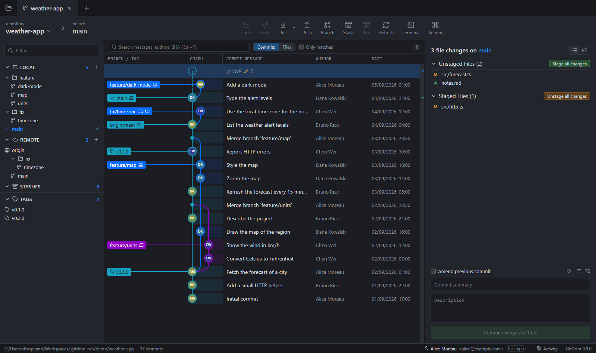
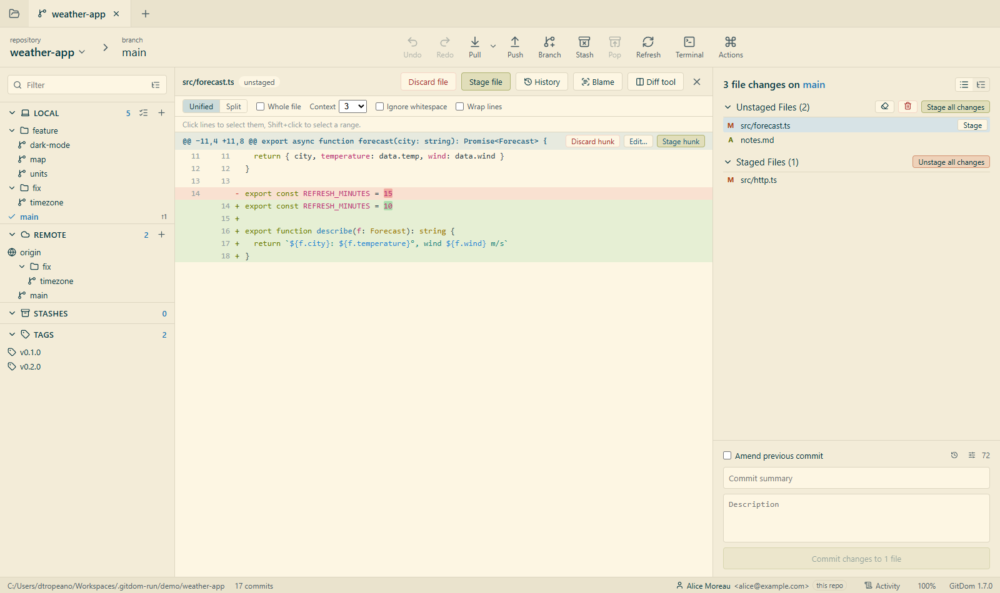
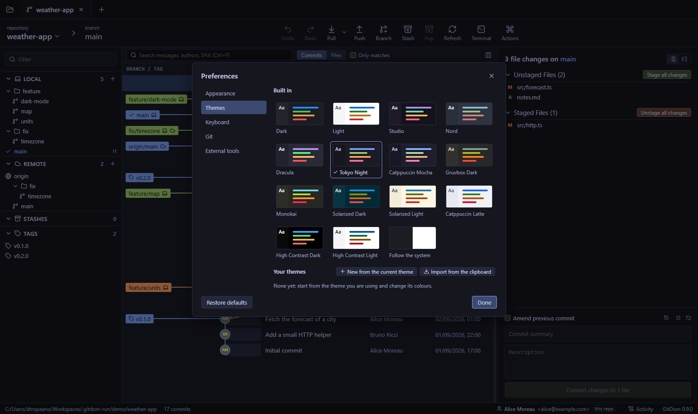
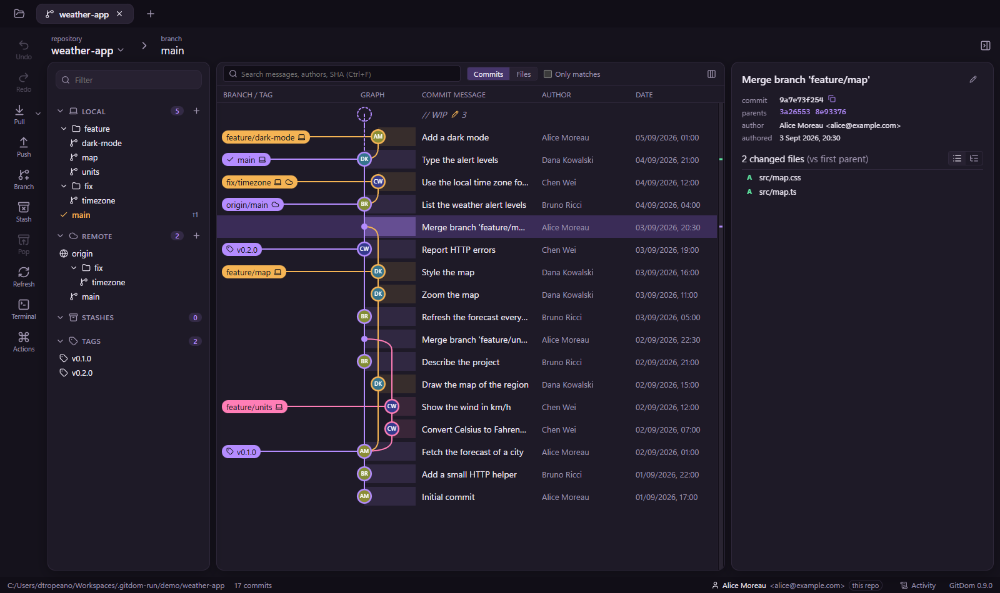
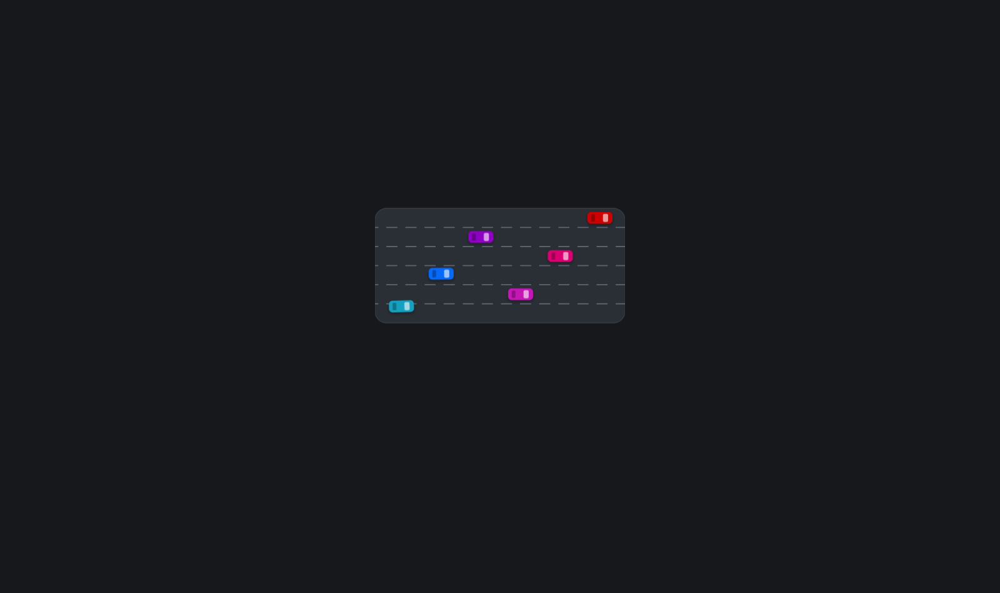

# GitDom

**A desktop Git client with an interactive commit graph.**
Many authors, one flow.

GitDom is a graphical client for everyday Git work: you can browse history, stage lines, merge, rebase and resolve conflicts from one window. It runs your installed `git` command line, so your hooks, config, credential manager, SSH keys and LFS work the same way they do in the terminal.



## Features

**Getting started with a repository**

- Open a local repository, clone one from an HTTPS or SSH URL, or create a new one (**File** menu)
- Clone with a progress bar and a Cancel button; you can pick a branch, a shallow depth, and whether to clone submodules
- New repositories can start with a `.gitignore` template, a README and a license, in a first commit
- Recent repositories on the start screen, with favorites pinned at the top

**Commit graph**

- Virtualized canvas graph with colored lanes and branch/tag labels, smooth at 60fps
- Histories of any size: the latest 10,000 commits load at once, older ones as you scroll (tested on a million commits)
- Local and remote branches that point to the same commit share one label
- Search by message, author, SHA or changed file (Ctrl+F), with matches highlighted, Enter to step through them, and an option to list only the matches
- Hide a branch from the graph, or show only one branch, from its right-click menu
- Resizable columns, an optional SHA column, and right-click the header to hide columns
- Author pictures from Gravatar (or GitHub for its noreply addresses), with initials when offline
- Stashes drawn as nodes on the commits they were made on
- Hover a branch label to highlight its line; a minimap beside the graph marks HEAD, the selection and the search matches
- Commit details, changed files as a list or a folder tree, and diffs with syntax highlighting

**Diffs**

- Unified or split (side by side) view, with the changed words highlighted inside each line
- Show the whole file with its changes, choose the context lines, ignore whitespace, wrap long lines
- Compare any two commits (Ctrl+click both in the graph), or a branch or tag with the current branch
- Images compared side by side, overlaid with an opacity slider, or with a swipe
- Open any change in your external diff tool (WinMerge, Beyond Compare, VS Code…)



**Everyday workflow**

- Stage and unstage whole files, single hunks or single lines; discard all the changes at once
- Commit, amend, and a WIP row for your uncommitted changes
- Commit options: skip the hooks (`--no-verify`), sign, commit as another author
- Commit message template (`commit.template`) and quick reuse of a recent message
- Edit the message of any commit on the current branch from its details (reword)
- Sign commits and tags with GPG, SSH or X.509 keys, and see whether each signature is verified
- Add a file, its extension or its folder to `.gitignore` from the file's menu
- Stash everything, only the staged changes, or a single file; optionally stash automatically on checkout
- Branches, checkout, tags and stashes from the sidebar, shown as folders (`feature/…`) or as a flat list; check out a tag to look at that version
- Pull (merge, fast-forward only or rebase), push, and a periodic background fetch

**Advanced operations**

- Merge, rebase and interactive rebase
- Conflict resolution view
- Cherry-pick, revert and reset (soft, mixed, hard)
- Drag a branch onto another to fast-forward, merge or rebase
- Undo / redo of the last operations

**Safety net**

- Activity log (**View → Activity Log**, `Ctrl+Shift+L`): every git command GitDom runs, grouped by action, with its duration, result and output
- Automatic backup of the branch before a reset, a rebase or a force push; restore it with one click or create a branch from it (**View → Backups**)
- Reflog of HEAD and of each branch, to find commits lost after a reset or a rebase (**View → Reflog**)

**Understanding the repository**

- Statistics (**View → Statistics**): commits, authors and their share, an activity calendar, commits per month with the growth of the code, the hours commits are made, and the languages of the project
- Hot files, changed most and most recently, and the files only one person knows, with the bus factor
- For the current branch or all of them, over any period; reading a big history can be stopped
- History of some lines or of a function: pick the lines in the blame, or type the function's name, and see every commit that changed them
- Search the code (**Code** beside the graph search): the commits where some text appeared or went away, or whose changed lines match a regular expression
- Browse the files of any commit (**All files** in the commit panel): read one as it was, with highlighting or as an image, and save it anywhere
- Blame back in time: from a line of the blame, the file just before that commit changed it, at the same place, and back again

**Productivity**

- Command palette (`Ctrl+Shift+P` or `Ctrl+P`) for every action
- Integrated terminal (`` Ctrl+` ``) that opens in the repository
- Blame and file history
- Several repositories open side by side in tabs
- Quick switcher on the repository name in the toolbar: open tabs, favorites and recent repositories, with search
- Workspaces: save the open tabs under a name and reopen them together
- Worktrees: check out a branch in its own folder, listed in the sidebar, to work on two branches at once
- Submodules: status, add, initialize, update and sync their URLs
- Git LFS: tracked patterns, LFS badges on files, track or untrack from the file list, download and upload the LFS files
- Author identity per repository or global, with saved profiles to switch between
- Open a file in your editor (VS Code or any command you choose) or show it in Explorer
- Launch your merge tool on a conflicted file, or your diff tool on any change

**Preferences** (**File → Preferences**, `Ctrl+,`)

- Interface and code fonts, code text size
- Zoom the whole interface with `Ctrl+=` / `Ctrl+-` / `Ctrl+0` or `Ctrl`+mouse wheel; the status bar shows the level
- Drag the edges of the side panels to resize them; GitDom remembers the sizes (double-click an edge to reset it)
- Background fetch interval (or off), default pull strategy, automatic stash on checkout
- Path of the git executable, external editor, merge tool and diff tool
- **Git config**: see and edit your global git settings and those of the open repository, with a filter
- Startup check for new versions

**Updates**

- At startup GitDom tells you when a newer version is out on GitHub
- **Update** downloads it in the background and checks it against the release's SHA-256; it's installed when you close GitDom, or right away with **Restart now**. The exe keeps its name and folder, so your shortcuts keep working
- If the download is blocked, or GitDom's folder isn't writable, **Download** opens the release page instead
- **Help → What's New** lists what each version added; the full list is in [CHANGELOG.md](CHANGELOG.md)

**Keyboard**

- Every shortcut is listed in **Preferences → Keyboard**, where you can give it other keys or remove them
- Move between the panels with `Ctrl+1` (sidebar), `Ctrl+2` (graph) and `Ctrl+3` (details); `Ctrl+Alt+F` filters the sidebar
- In the graph, the arrow keys, Page Up/Down, Home and End move the selection, and Enter goes to the details
- In the sidebar and the file lists, the arrow keys move between the items; Enter checks out a branch or opens a file's diff, and `Space` stages or unstages the file
- `Alt+Down` / `Alt+Up` (or `F7` / `Shift+F7`) jump to the next or previous change in a diff
- The menu key or `Shift+F10` opens the right-click menu of the selected item, and the arrow keys move through it

**Themes**

- Dark, Light, or follow the system setting
- **Studio**: a different layout, with floating rounded panels, actions in a rail on the left and a collapsible detail panel
- Ready-made themes: Nord, Dracula, Tokyo Night, Catppuccin (Mocha and Latte), Gruvbox Dark, Monokai, Solarized (dark and light), and high-contrast dark and light
- **Your own themes**: start from any theme and change its colors in **Preferences → Themes**; GitDom checks that text stays readable (WCAG contrast) and warns you if it doesn't. Themes can be exported and imported as text through the clipboard
- To switch theme, use **Preferences → Themes**, **Window → Theme** or the command palette





At startup GitDom shows its logo: cars on a six-lane highway change lanes without ever touching, like changes from many authors flowing through Git. Click or press any key to skip it. You can also turn it off in Preferences or from the command palette.

<p align="center"></p>

## Download

Get `GitDom-<version>-portable.exe` from the [Releases](https://github.com/oromis95/gitdom/releases) page. It's a single self-contained exe that you start with a double-click; there's nothing to install. You need [Git](https://git-scm.com/) on the `PATH`.

## Requirements

- [Git](https://git-scm.com/) on the `PATH`
- [Node.js](https://nodejs.org/) 22 or later, to build from source
- Windows 10/11 is the tested platform. macOS and Linux should work through Electron, but they haven't been tested.

## Getting started

```bash
git clone https://github.com/oromis95/gitdom.git
cd gitdom
npm install
npm run dev
```

| Command                              | What it does                                        |
| ------------------------------------ | --------------------------------------------------- |
| `npm run dev`                        | Starts the app in development mode, with hot reload |
| `npm start`                          | Builds and starts a production preview              |
| `npm test`                           | Runs the unit and integration tests (Vitest)        |
| `npm run lint` / `npm run typecheck` | Checks code style and types                         |
| `npm run build:unpack`               | Builds a standalone app folder in `dist/`           |
| `npm run build:win`                  | Builds a Windows installer                          |
| `npm run build:portable`             | Builds a single self-contained Windows exe          |

## Tech stack

- **Electron** with **electron-vite**
- **React** + **TypeScript** for the interface, with **Zustand** for state
- Git runs as child processes of the main process. Its output is parsed and sent to the interface over IPC.
- **Canvas 2D** for the commit graph
- **highlight.js** for diffs
- **xterm.js** + **node-pty** for the integrated terminal
- **Vitest** tests, run against real temporary repositories, on GitHub Actions at every push (formatting, lint, types, tests and a build; a release is published only when they pass); `GITDOM_BENCH=<path> npx vitest run bench` times the loading of a big repository

```
src/
  main/       Electron main process: git commands, file watcher, terminal, menu
  preload/    Bridge that exposes a typed API to the interface
  renderer/   React interface: graph, panels, diff, dialogs, themes
  shared/     Types and helpers shared by both sides
docs/         Requirements (Italian) and screenshots
```

## Status

GitDom is a personal project under active development (version 1.2.0).
The full list of requirements is in [docs/REQUISITI.md](docs/REQUISITI.md), and the plan for the next versions is in [docs/ROADMAP.md](docs/ROADMAP.md) (both in Italian).

## License

[MIT](LICENSE)
